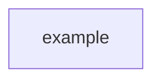
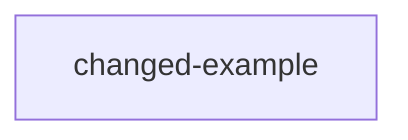
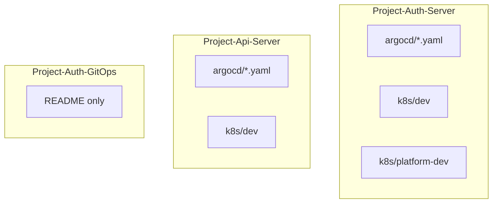
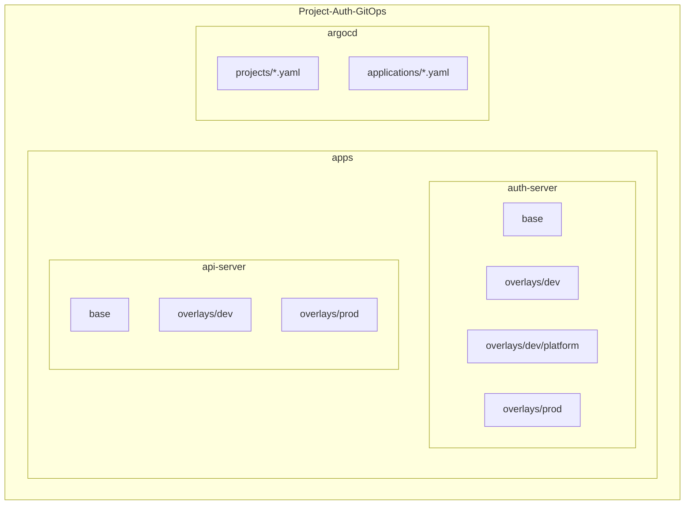
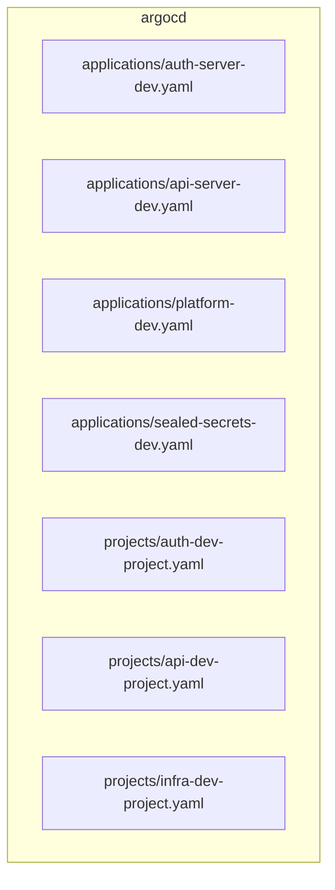
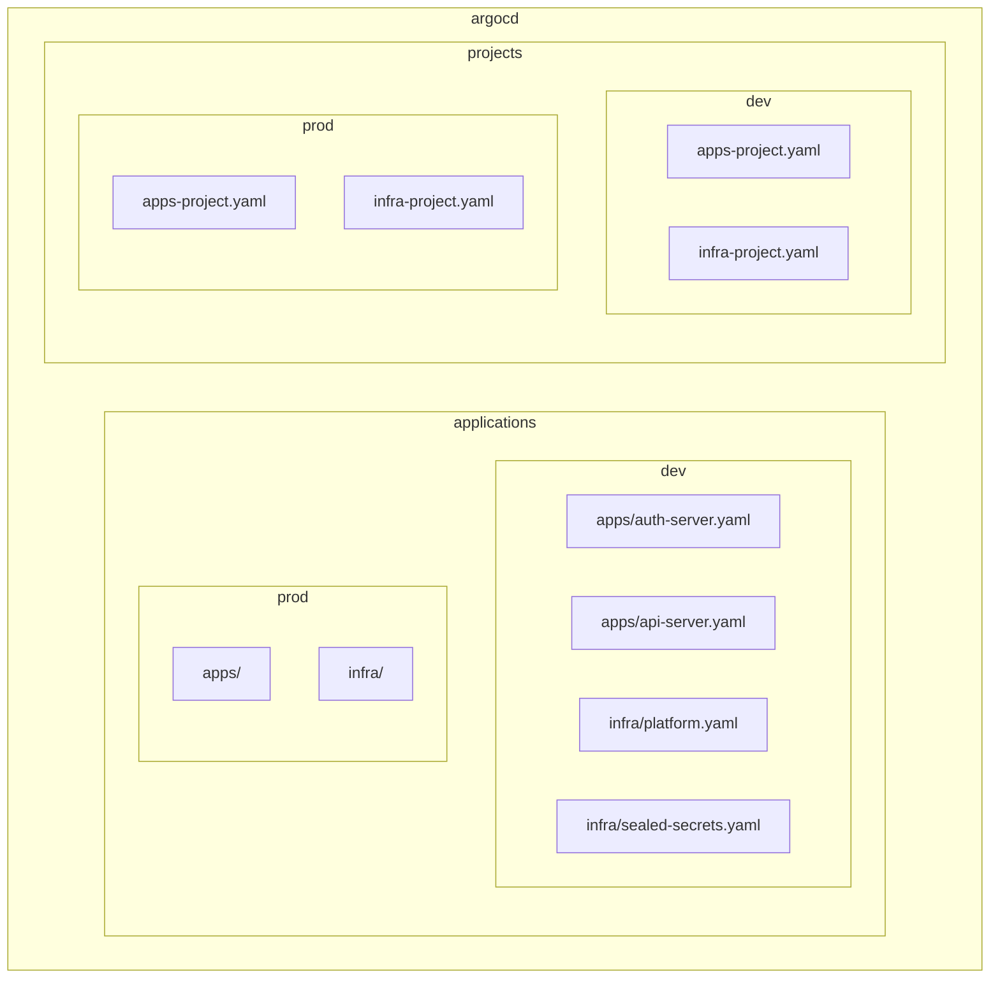

# Project-Auth-GitOps
GitOps repo에서는 앱별 공통(base)과 환경별 차이(overlay)만 관리하고, 실제 운영 선언만 둡니다.

## README 작성 원칙

이 저장소의 README에는 `ops` 관련 내용만 기록합니다.

문서 작성은 1회성 정리가 아니라 **변경 이력 누적 방식**으로 관리합니다.
즉, 기존에 작성한 구조/문제점/개선 내용을 지우고 새로 덮어쓰지 않고, **항상 기존 내용 아래에 이어서 추가**합니다.

이 README에는 아래 사이클을 반복해서 계속 누적 작성합니다.

1. 처음 구조 `mermaid`
2. 해당 구조의 문제점
3. 변경된 후 구조 `mermaid`
4. 이전 구조 대비 변경된 점
5. 변경으로 해결된 내용

## 기록 규칙

- 이전 사이클은 삭제하거나 수정해서 덮어쓰지 않습니다.
- 새로운 `ops` 변경이 생기면 README의 가장 아래에 새 사이클을 추가합니다.
- 각 사이클은 당시의 구조, 문제, 개선 결과가 모두 보이도록 독립적으로 작성합니다.
- 구조 설명은 가능하면 `mermaid` 다이어그램으로 남깁니다.
- 변경된 점은 반드시 **이전 구조와 비교**해서 작성합니다.
- 해결 내용은 어떤 문제가 어떻게 해소되었는지 명확하게 작성합니다.

## 작성 템플릿

아래 형식을 반복해서 README 하단에 계속 추가합니다.

````md
## Cycle N

### 1. 초기 구조


### 2. 문제점
- 문제 1
- 문제 2

### 3. 변경 후 구조


### 4. 이전 구조 대비 변경점
- 변경점 1
- 변경점 2

### 5. 해결된 내용
- 해결 1
- 해결 2
````

## Cycle 1

### 1. 초기 구조


### 2. 문제점
- 운영 선언이 `Project-Auth-Server`와 `Project-Api-Server`에 분산되어 있어서 GitOps 저장소가 실제 단일 운영 기준점이 아니었습니다.
- `auth-server`는 `k8s/dev`와 `k8s/platform-dev`가 분리돼 있었지만, 현재 GitOps 저장소 기준의 공통 `base`와 환경별 `overlay` 구조가 없었습니다.
- Argo CD `Application`의 source repo가 각 서비스 repo를 가리키고 있어, 운영 경로를 한 저장소에서 일관되게 추적하기 어려웠습니다.
- 두 서비스 모두 `prod`를 수용할 고정 overlay 진입점이 없어 이후 환경 확장 시 구조가 다시 흔들릴 수 있었습니다.

### 3. 변경 후 구조


### 4. 이전 구조 대비 변경점
- `auth-server`와 `api-server`의 Kubernetes 운영 매니페스트를 현재 GitOps repo의 `apps/` 아래로 이관했습니다.
- 앱 공통 리소스는 `base`로 분리하고, namespace/configmap/sealed secret/image tag 같은 환경 값은 `overlays/dev`로 분리했습니다.
- `auth-server`의 `platform-dev` 리소스는 `apps/auth-server/overlays/dev/platform`으로 옮겨 기존 dev platform 운영 구성을 유지했습니다.
- Argo CD `AppProject`와 `Application`도 현재 GitOps repo 기준으로 재배치하고, `repoURL`과 `path`를 새 구조에 맞게 변경했습니다.
- 원본 repo에 `prod` 운영 매니페스트는 없었기 때문에, 이번 변경에서는 `overlays/prod`에 namespace와 kustomization 골격만 먼저 추가했습니다.

### 5. 해결된 내용
- 이제 `Project-Auth-GitOps`가 `auth-server`, `api-server`, `platform-dev`의 운영 선언을 모으는 단일 저장소 역할을 하게 되었습니다.
- 서비스마다 서로 다른 운영 경로를 읽지 않아도 되어, 변경 리뷰와 Argo CD 추적 기준이 단순해졌습니다.
- 이후 환경이 늘어나더라도 `apps/<service>/base`와 `apps/<service>/overlays/<env>` 패턴으로 같은 방식의 확장이 가능해졌습니다.
- `auth-dev` 프로젝트에 `SealedSecret` 허용 리소스를 추가해, 이관된 sealed secret 리소스가 Argo CD 정책과 맞지 않던 문제도 함께 정리했습니다.

## Cycle 2

### 1. 초기 구조


### 2. 문제점
- `applications`와 `projects`가 파일 단위로 평평하게 놓여 있어서 `dev/prod` 경계와 `apps/infra` 경계가 디렉터리 구조에 드러나지 않았습니다.
- 앱용 프로젝트가 `auth-dev`, `api-dev`로 분산돼 있어, 같은 성격의 애플리케이션을 한 번에 파악하기 어려웠습니다.
- `prod`용 Argo CD 진입점이 구조상 준비돼 있지 않아 환경 확장 시 다시 디렉터리 재정리가 필요했습니다.
- 파일 수가 늘어날수록 어떤 선언이 서비스용인지 인프라용인지 찾는 비용이 계속 커질 구조였습니다.

### 3. 변경 후 구조


### 4. 이전 구조 대비 변경점
- Argo CD 선언을 `argocd/applications/<env>/<apps|infra>`와 `argocd/projects/<env>` 구조로 재배치했습니다.
- `auth-server`와 `api-server`는 `dev/apps` 아래로, `platform`과 `sealed-secrets`는 `dev/infra` 아래로 나눠 목적별 경계를 디렉터리에서 바로 보이게 했습니다.
- 기존 `auth-dev`와 `api-dev` AppProject는 `apps-dev` 하나로 통합하고, `platform`과 `sealed-secrets`는 `infra-dev` 프로젝트로 정리했습니다.
- `prod`는 아직 실제 Application이 없지만, `applications/prod`와 `projects/prod` 골격을 미리 만들어 이후 추가 위치를 고정했습니다.
- `argocd/README.md`를 추가해 이 구조 규칙을 디렉터리 안에서도 바로 확인할 수 있게 했습니다.

### 5. 해결된 내용
- 이제 Argo CD 선언만 보더라도 환경별 구분과 성격별 구분이 동시에 드러나서 탐색 비용이 줄었습니다.
- 서비스 애플리케이션과 공용 인프라가 각자 어떤 AppProject를 쓰는지 일관되게 정리되어 관리 포인트가 단순해졌습니다.
- `prod` 확장 시 새 파일을 어디에 둬야 하는지 미리 정해져 있어, 다음 변경에서도 구조를 다시 흔들 필요가 없어졌습니다.
- `argocd` 자체도 README 기반의 누적 관리 대상이 되면서, 구조 변경 이유를 README와 디렉터리 문서에서 함께 추적할 수 있게 됐습니다.
