# Project-Auth-GitOps
GitOps repo에서는 앱/인프라별 공통(base)과 환경별 차이(overlay)를 관리하고, 실제 운영 선언만 둡니다.

## 현재 최신 Dev 아키텍처

최상단 아키텍처는 **항상 최신 dev 기준**만 유지합니다.
아키텍처가 변경되면 이 섹션은 최신 상태로 갱신하고, 변경 이유와 전후 비교는 아래 cycle에 누적 기록합니다.

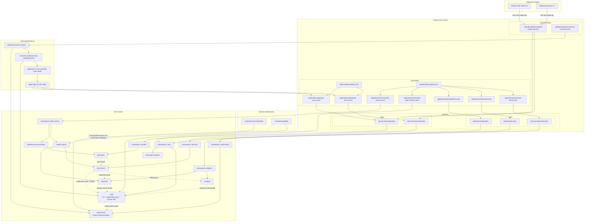

## 이 저장소의 역할

이 저장소는 **CI가 아니라 CD 중심 GitOps repo**입니다.

- Kubernetes manifest 관리
- Argo CD `Application` / `AppProject` 관리
- 이미지 태그 업데이트 반영
- 환경별 overlay 관리
- 실제 배포 반영

## 현재 CD 반영 흐름

1. 앱 repo(`Project-Auth-Server`, `Project-Api-Server`)에서 `feature -> main/develop` 병합 후 CI를 실행합니다.
2. CI가 테스트 통과 뒤 이미지를 build/push하고 새 이미지 태그를 만듭니다.
3. 앱 repo CI는 이미지 push 뒤 `repository_dispatch`로 이 저장소의 `.github/workflows/update-image-tag.yaml`을 호출해 dev overlay 태그를 갱신합니다.
4. self-hosted runner의 `.github/workflows/vault-dev-reconcile.yaml` 이 transit provider bootstrap, workload Vault reconcile, dev KV populate, Argo CD dev 정의 적용을 자동 수행합니다.
5. Argo CD가 GitOps repo와 Application 변경을 감지합니다.
6. `vault-transit` provider가 workload Vault의 transit auto-unseal을 지원합니다.
7. Argo CD가 cluster에 실제 배포를 반영합니다.

즉, 앱 repo는 **CI 책임**, GitOps repo는 **CD 책임**을 갖고, 이미지 태그는 앱 repo가 자기 repo manifest를 수정하는 대신 **GitOps repo를 갱신하는 방식**으로 반영합니다.

## 현재 Secret Lifecycle

- `ghcr-regcred`처럼 **image pull secret**이 필요한 항목만 `SealedSecret`을 유지합니다.
- `auth-server`, `postgres`, `keycloak`의 **runtime secret**은 더 이상 Git이나 workflow secret에 넣지 않고 workload Vault KV(`kv/dev/...`)에 저장합니다.
- workload KV의 seed 값과 workload Vault bootstrap token은 `vault-transit` provider Vault KV가 source of truth 역할을 합니다.
- `vault-transit` provider와 workload Vault는 각각 클러스터 밖 runbook으로 1회 init/bootstrap 합니다.
- 이후 dev 자동화는 self-hosted runner의 CI secret store에 저장한 **transit provider workflow AppRole 정보**만 사용하고, 실제 workload secret 값은 provider Vault에서 읽습니다.
- root token은 bootstrap 직후 revoke하는 것을 기본값으로 두고, Kubernetes 안에는 저장하지 않습니다.
- 애플리케이션과 플랫폼 워크로드는 Vault Agent Injector와 Kubernetes auth로 인증하고 secret file을 렌더링받습니다.
- workload Vault는 `vault-transit` provider가 발급한 최소 권한 transit token으로 auto-unseal 합니다.
- `auth-server`는 Injector가 공유한 Vault token file을 사용해 workload Vault Transit을 계속 호출합니다.

## Auto-unseal 상태

- 현재 dev 환경은 **Vault 2개 구조의 Transit auto-unseal** 을 전제로 합니다.
- `vault-transit` provider가 `workload-vault-dev-unseal` transit key를 제공하고, workload Vault는 `vault-transit-seal` secret의 최소 권한 token으로 auto-unseal 합니다.
- CI secret store는 provider Vault workflow AppRole 같은 최소 자동화 정보만 보관합니다.
- 이 구조는 단일 Vault보다 운영 난이도는 높지만, root token 직접 사용 최소화와 trust boundary 분리에 더 유리합니다.

## 현재 Dev 접근 경로

- `auth-server`, `api-server`, `keycloak` 은 여전히 `ClusterIP` 로 유지하고, dev에서는 `traefik` `Ingress` 를 north-south 진입점으로 둡니다.
- public host는 `auth-public.auth-dev.svc.cluster.local`, `api-public.api-dev.svc.cluster.local`, `keycloak-public.platform.svc.cluster.local` 로 분리하고, namespace 내부 DNS에서는 `ExternalName -> traefik` 경로로 같은 호스트를 해석합니다.
- 외부 접근이 필요할 때는 운영자 노트북의 `hosts` 파일을 현재 Traefik `LoadBalancer` IP 또는 dev node IP로 매핑해 callback/redirect 와 브라우저 접근을 엽니다.
- 예시: `<TRAEFIK_LB_IP> auth-public.auth-dev.svc.cluster.local api-public.api-dev.svc.cluster.local keycloak-public.platform.svc.cluster.local`
- dev public ingress는 HTTP만 사용합니다.
- `auth-server` 와 `api-server` 는 namespace 내부에서도 같은 public host를 HTTP로 호출합니다.
- east-west는 `auth-dev`, `api-dev`, `platform`, `vault` namespace에 `default deny + allowlist` `NetworkPolicy` 를 적용해 필요한 흐름만 열어둡니다.

## README 작성 원칙

이 저장소의 README에는 `ops` 관련 내용만 기록합니다.

문서 작성은 1회성 정리가 아니라 **변경 이력 누적 방식**으로 관리합니다.
즉, 기존에 작성한 구조/문제점/개선 내용을 지우고 새로 덮어쓰지 않고, **항상 기존 내용 아래에 이어서 추가**합니다.
다만 README 최상단의 `현재 최신 Dev 아키텍처` 섹션은 예외적으로 **항상 최신 상태로 갱신**합니다.

이 README에는 아래 사이클을 반복해서 계속 누적 작성합니다.

1. 처음 구조 `mermaid`
2. 해당 구조의 문제점
3. 변경된 후 구조 `mermaid`
4. 이전 구조 대비 변경된 점
5. 변경으로 해결된 내용

## 기록 규칙

- 이전 사이클은 삭제하거나 수정해서 덮어쓰지 않습니다.
- README 최상단의 `현재 최신 Dev 아키텍처`는 최신 상태만 유지하고, 예전 아키텍처는 cycle로 추적합니다.
- 새로운 `ops` 변경이 생기면 README의 가장 아래에 새 사이클을 추가합니다.
- 아키텍처 변경이 생기면 먼저 최상단 `현재 최신 Dev 아키텍처`를 갱신하고, 같은 변경을 새 cycle에 기록합니다.
- 각 사이클은 당시의 구조, 문제, 개선 결과가 모두 보이도록 독립적으로 작성합니다.
- 구조 설명은 가능하면 `mermaid` 다이어그램으로 남깁니다.
- 변경된 점은 반드시 **이전 구조와 비교**해서 작성합니다.
- 해결 내용은 어떤 문제가 어떻게 해소되었는지 명확하게 작성합니다.
- 런타임 장애나 수동 운영 이슈를 해결했으면, README 하단 cycle에 **재현 명령, 핵심 관찰값, 판단 근거, 수정 내용, 검증 명령** 을 함께 남깁니다.
- 트러블슈팅 명령은 가능하면 실제로 사용한 형태 그대로 남기고, 왜 그 명령을 쳤는지 한 줄로 설명합니다.
- secret, token, kubeconfig 본문처럼 민감한 값은 절대 그대로 기록하지 않고, 값의 존재 여부나 길이만 요약합니다.

## 작성 템플릿

아래 형식을 반복해서 README 하단에 계속 추가합니다.

````md
## Cycle N

### 1. 초기 구조
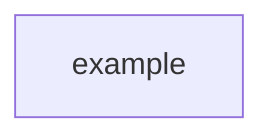

### 2. 문제점
- 문제 1
- 문제 2

### 3. 변경 후 구조
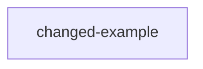

### 4. 이전 구조 대비 변경점
- 변경점 1
- 변경점 2

### 5. 해결된 내용
- 해결 1
- 해결 2

### 6. 트러블슈팅 메모
- 재현/확인 명령
- 핵심 관찰값
- 판단 근거
- 수정 또는 조치
- 검증 명령
````

## 트러블슈팅 메모 작성 예시

- 재현/확인 명령: `kubectl -n argocd describe application vault-transit-dev`
- 핵심 관찰값: `authentication required: Repository not found`
- 판단 근거: Argo CD app spec 자체는 존재하지만 repo-server가 source repo를 읽지 못해 manifest generation 전에 실패한다고 봤습니다.
- 수정 또는 조치: `argocd` namespace에 `repo-creds` secret을 선언형으로 적용했습니다.
- 검증 명령: `kubectl -n argocd annotate application vault-transit-dev argocd.argoproj.io/refresh=hard --overwrite`

## Cycle 1

### 1. 초기 구조
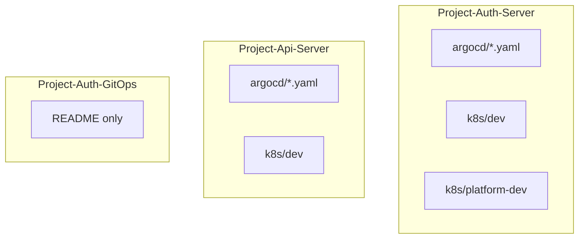

### 2. 문제점
- 운영 선언이 `Project-Auth-Server`와 `Project-Api-Server`에 분산되어 있어서 GitOps 저장소가 실제 단일 운영 기준점이 아니었습니다.
- `auth-server`는 `k8s/dev`와 `k8s/platform-dev`가 분리돼 있었지만, 현재 GitOps 저장소 기준의 공통 `base`와 환경별 `overlay` 구조가 없었습니다.
- Argo CD `Application`의 source repo가 각 서비스 repo를 가리키고 있어, 운영 경로를 한 저장소에서 일관되게 추적하기 어려웠습니다.
- 두 서비스 모두 `prod`를 수용할 고정 overlay 진입점이 없어 이후 환경 확장 시 구조가 다시 흔들릴 수 있었습니다.

### 3. 변경 후 구조
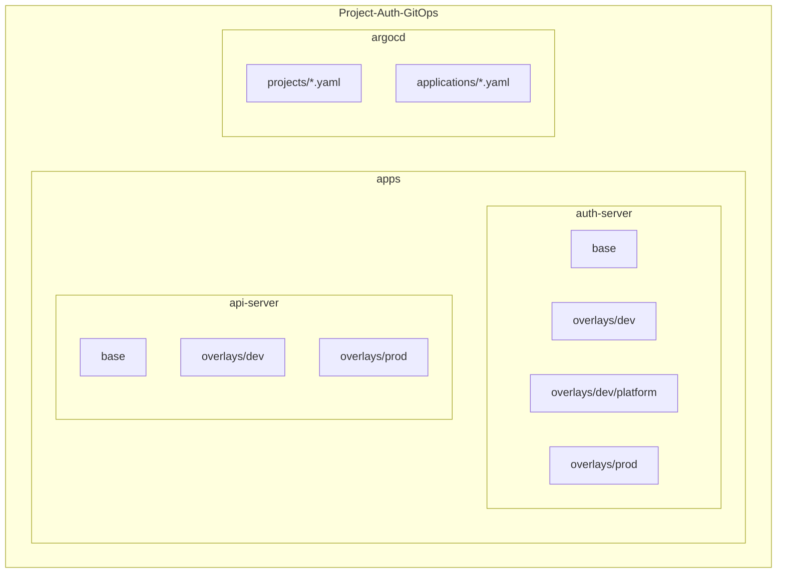

### 4. 이전 구조 대비 변경점
- `auth-server`와 `api-server`의 Kubernetes 운영 매니페스트를 현재 GitOps repo의 `apps/` 아래로 이관했습니다.
- 앱 공통 리소스는 `base`로 분리하고, namespace/configmap/sealed secret/image tag 같은 환경 값은 `overlays/dev`로 분리했습니다.
- `auth-server`의 `platform-dev` 리소스는 `apps/auth-server/overlays/dev/platform`으로 옮겨 기존 dev platform 운영 구성을 유지했습니다.
- Argo CD `AppProject`와 `Application`도 현재 GitOps repo 기준으로 재배치하고, `repoURL`과 `path`를 새 구조에 맞게 변경했습니다.
- 원본 repo에 `prod` 운영 매니페스트는 없었기 때문에, 이번 변경에서는 `overlays/prod`에 namespace와 kustomization 골격만 먼저 추가했습니다.

### 5. 해결된 내용
- 이제 `Project-Auth-GitOps`가 `auth-server`, `api-server`, `platform-dev`의 운영 선언을 모으는 단일 저장소 역할을 하게 되었습니다.
- 서비스마다 서로 다른 운영 경로를 읽지 않아도 되어, 변경 리뷰와 Argo CD 추적 기준이 단순해졌습니다.
- 이후 환경이 늘어나더라도 `apps/<service>/base`와 `apps/<service>/overlays/<env>` 패턴으로 같은 방식의 확장이 가능해졌습니다.
- `auth-dev` 프로젝트에 `SealedSecret` 허용 리소스를 추가해, 이관된 sealed secret 리소스가 Argo CD 정책과 맞지 않던 문제도 함께 정리했습니다.

## Cycle 2

### 1. 초기 구조
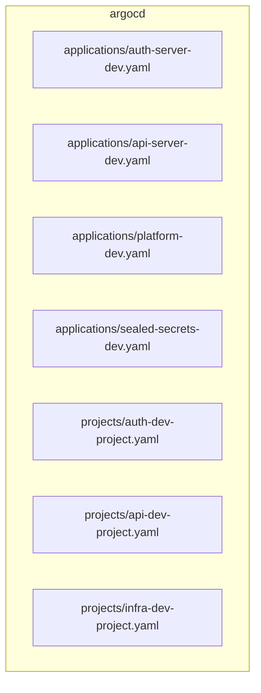

### 2. 문제점
- `applications`와 `projects`가 파일 단위로 평평하게 놓여 있어서 `dev/prod` 경계와 `apps/infra` 경계가 디렉터리 구조에 드러나지 않았습니다.
- 앱용 프로젝트가 `auth-dev`, `api-dev`로 분산돼 있어, 같은 성격의 애플리케이션을 한 번에 파악하기 어려웠습니다.
- `prod`용 Argo CD 진입점이 구조상 준비돼 있지 않아 환경 확장 시 다시 디렉터리 재정리가 필요했습니다.
- 파일 수가 늘어날수록 어떤 선언이 서비스용인지 인프라용인지 찾는 비용이 계속 커질 구조였습니다.

### 3. 변경 후 구조
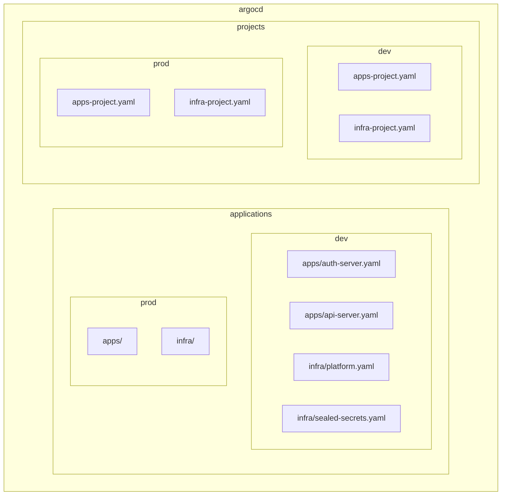

### 4. 이전 구조 대비 변경점
- Argo CD 선언을 `argocd/applications/<env>/<apps|infra>`와 `argocd/projects/<env>` 구조로 재배치했습니다.
- `auth-server`와 `api-server`는 `dev/apps` 아래로, `platform`과 `sealed-secrets`는 `dev/infra` 아래로 나눠 목적별 경계를 디렉터리에서 바로 보이게 했습니다.
- 기존 `auth-dev`와 `api-dev` AppProject는 `apps-dev` 하나로 통합하고, `platform`과 `sealed-secrets`는 `infra-dev` 프로젝트로 정리했습니다.
- `prod`는 아직 실제 Application이 없지만, `applications/prod`와 `projects/prod` 골격을 미리 만들어 이후 추가 위치를 고정했습니다.
- `argocd/README.md`를 추가해 이 구조 규칙을 디렉터리 안에서도 바로 확인할 수 있게 했습니다.

### 5. 해결된 내용
- 이제 Argo CD 선언만 보더라도 환경별 구분과 성격별 구분이 동시에 드러나서 탐색 비용이 줄었습니다.
- 서비스 애플리케이션과 공용 인프라가 각자 어떤 AppProject를 쓰는지 일관되게 정리되어 관리 포인트가 단순해졌습니다.
- `prod` 확장 시 새 파일을 어디에 둬야 하는지 미리 정해져 있어, 다음 변경에서도 구조를 다시 흔들 필요가 없어졌습니다.
- `argocd` 자체도 README 기반의 누적 관리 대상이 되면서, 구조 변경 이유를 README와 디렉터리 문서에서 함께 추적할 수 있게 됐습니다.

## Cycle 3

### 1. 초기 구조
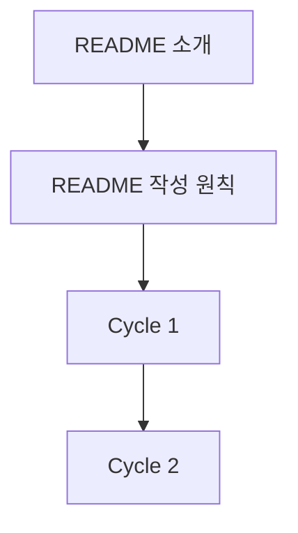

### 2. 문제점
- 현재 운영 중인 dev 아키텍처를 README 최상단에서 바로 볼 수 있는 기준 그림이 없었습니다.
- 변경 이력은 누적되고 있었지만, 최신 구조를 한 번에 확인하려면 여러 cycle을 직접 읽어야 했습니다.
- README의 누적 기록 규칙만 있고, `최신 아키텍처는 어디를 기준으로 볼지`에 대한 별도 원칙이 없었습니다.

### 3. 변경 후 구조
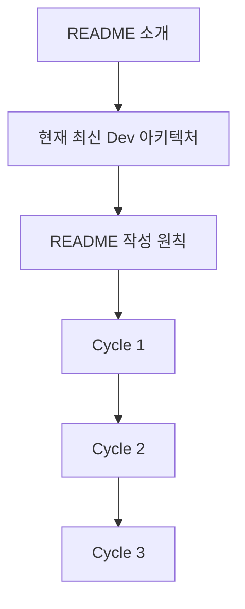

### 4. 이전 구조 대비 변경점
- README 최상단에 현재 기준의 **최신 dev 아키텍처**를 `mermaid`로 추가했습니다.
- 최상단 아키텍처는 항상 최신 상태로 갱신하고, 이전 구조 변화는 cycle로 누적 기록한다는 규칙을 명시했습니다.
- 현재 단계에서는 요청하신 대로 `prod`는 제외하고 `dev` 운영 구조만 아키텍처에 반영했습니다.
- 아키텍처 그림 안에는 Argo CD project/application, GitOps manifest 경로, dev cluster 주요 namespace와 런타임 의존 관계를 함께 드러내도록 정리했습니다.

### 5. 해결된 내용
- 이제 README를 열면 가장 먼저 현재 dev 운영 구조를 확인할 수 있어 최신 상태 파악이 훨씬 빨라졌습니다.
- 최신 구조와 변경 이력을 분리해, 상단은 현재 기준점으로 쓰고 하단 cycle은 히스토리로 쓰는 역할이 명확해졌습니다.
- 이후 dev 아키텍처가 바뀌더라도 어떤 내용을 갱신하고 어떤 내용을 누적해야 하는지 README 규칙만 보고 바로 따라갈 수 있게 됐습니다.

## Cycle 4

### 1. 초기 구조
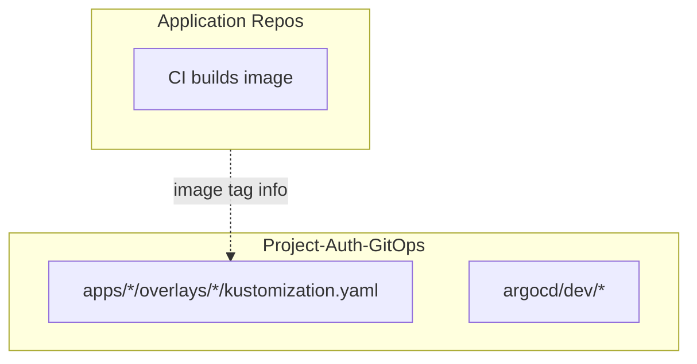

### 2. 문제점
- GitOps repo가 CD 중심 저장소라는 역할은 정리됐지만, 이미지 태그를 **어떤 진입점으로 갱신할지**가 이 저장소 안에 아직 명시돼 있지 않았습니다.
- 앱 repo가 이미지를 push한 뒤 GitOps repo를 어떻게 업데이트해야 하는지 표준 스크립트나 workflow가 없어, 저장소마다 방식이 달라질 수 있었습니다.
- README에도 이 저장소가 `CI`가 아니라 `CD`를 담당한다는 운영 원칙과 실제 반영 흐름이 구조적으로 정리돼 있지 않았습니다.

### 3. 변경 후 구조
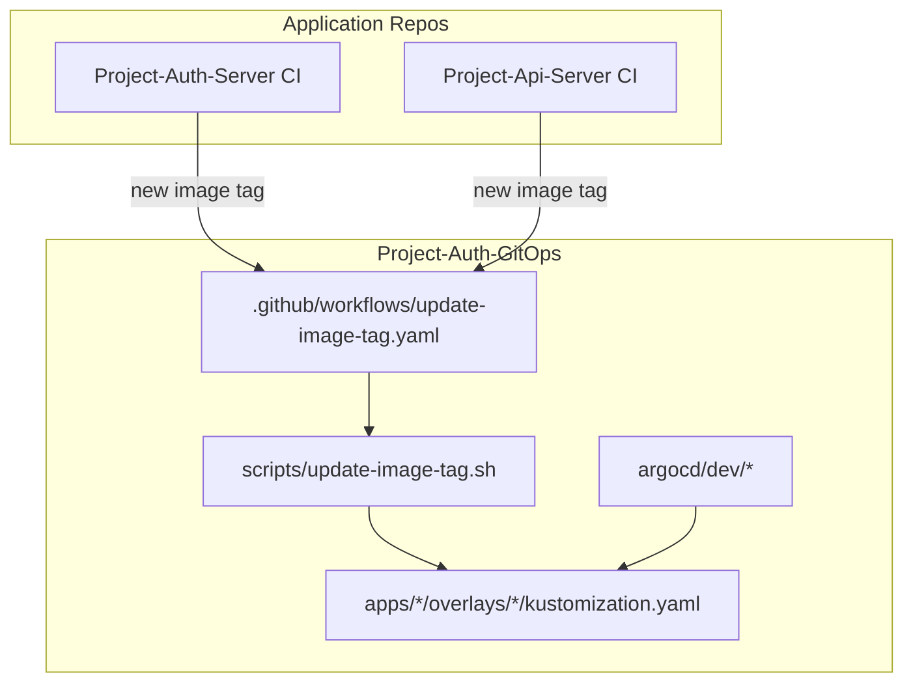

### 4. 이전 구조 대비 변경점
- GitOps repo에 이미지 태그 갱신용 스크립트 `scripts/update-image-tag.sh`를 추가했습니다.
- GitOps repo 내부에서 직접 태그 갱신 commit/push를 수행할 수 있도록 `.github/workflows/update-image-tag.yaml` workflow를 추가했습니다.
- workflow는 `workflow_dispatch`와 `repository_dispatch` 둘 다 받을 수 있게 구성해, 수동 실행과 앱 repo CI 연동 둘 다 가능하도록 했습니다.
- README 최상단 dev 아키텍처에도 앱 repo CI에서 GitOps repo로 태그가 반영되는 흐름을 함께 반영했습니다.
- README에 이 저장소의 역할과 현재 CD 반영 흐름을 별도 섹션으로 정리했습니다.

### 5. 해결된 내용
- 이제 이 저장소 안에 `이미지 태그 업데이트`를 수행하는 공식 진입점이 생겨, CD 반영 방식이 문서와 파일 기준으로 일치하게 되었습니다.
- 앱 repo는 자기 저장소의 manifest를 다시 수정하지 않고, GitOps repo를 갱신하는 방식으로 역할이 명확히 분리되었습니다.
- 이후 앱 repo CI는 새 이미지 태그만 전달하면 되고, 실제 배포 반영은 GitOps repo와 Argo CD 흐름 안에서 일어나도록 정리되었습니다.

## Cycle 5

### 1. 초기 구조
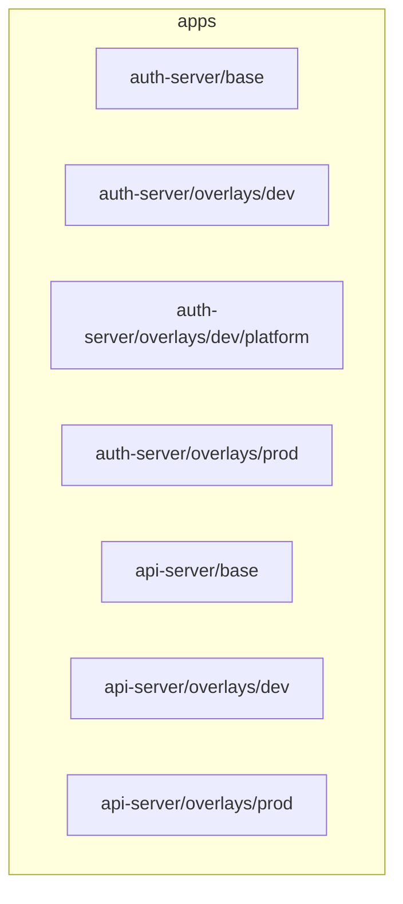

### 2. 문제점
- `platform`이 `apps/auth-server` 하위에 있어, 앱 배포와 공용 인프라 배포의 책임 경계가 디렉터리 구조상 섞여 있었습니다.
- `postgres`, `keycloak`, `vault`는 `auth-server`의 일부라기보다 공용 infra인데도 앱 overlay에 포함돼 있어 탐색과 확장이 불편했습니다.
- `dev`와 `prod`를 분리할 때도 `platform`이 앱 트리 안에 있으면 인프라 확장 경로가 일관되지 않았습니다.

### 3. 변경 후 구조
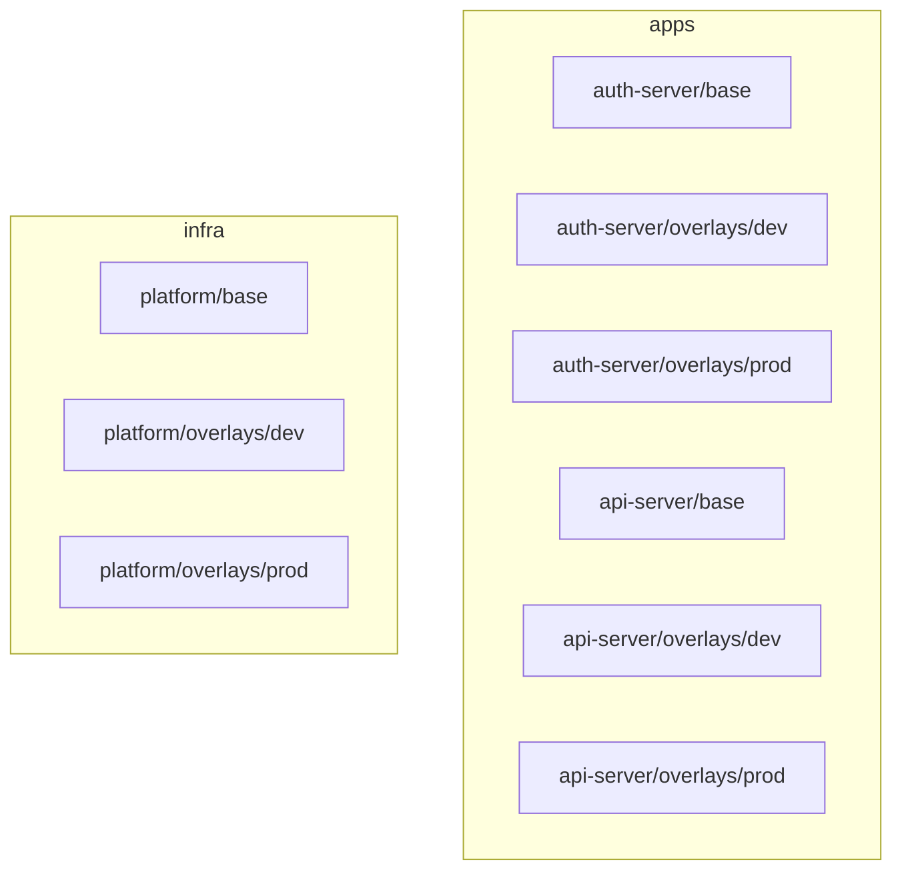

### 4. 이전 구조 대비 변경점
- `apps/auth-server/overlays/dev/platform`에 있던 리소스를 `infra/platform/base`와 `infra/platform/overlays/dev`로 분리했습니다.
- `postgres`, `keycloak`, `vault` 워크로드와 공통 생성 파일은 `infra/platform/base`로 옮기고, namespace/configmap/sealed secret은 `infra/platform/overlays/dev`로 분리했습니다.
- `infra/platform/overlays/prod`도 함께 추가해 `platform-prod` namespace와 prod용 config skeleton을 둘 수 있게 했습니다.
- Argo CD `platform-dev` Application의 source path를 새 infra 경로로 변경했습니다.
- README 최상단 최신 dev 아키텍처도 `apps`와 `infra`가 분리된 현재 구조 기준으로 갱신했습니다.

### 5. 해결된 내용
- 이제 `platform`은 앱 하위 부속이 아니라 독립된 infra 영역으로 보이기 때문에 구조 해석이 훨씬 자연스러워졌습니다.
- 앱 배포 경로와 인프라 배포 경로가 분리되어, 이후 `infra` 확장이나 세분화로 이어가기가 쉬워졌습니다.
- `dev`뿐 아니라 `prod`도 같은 `infra/platform/base -> overlays/<env>` 패턴으로 관리할 준비가 갖춰졌습니다.

## Cycle 6

### 1. 초기 구조
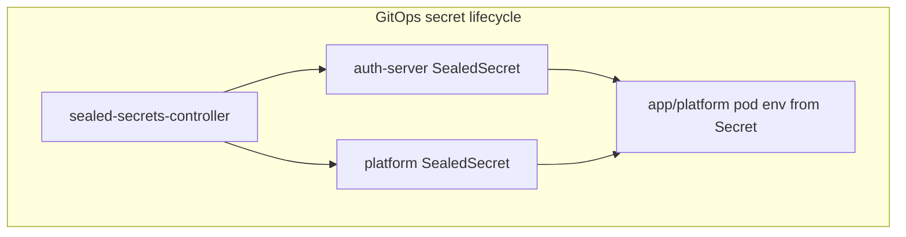

### 2. 문제점
- `SealedSecret`으로 평문을 Git에 직접 넣지는 않았지만, secret source 자체가 여전히 GitOps 저장소 안의 정적 파일이었습니다.
- secret rotation과 변경 이력이 결국 Git commit 중심이 되어, 운영형 secret lifecycle이라고 보기 어려웠습니다.
- `auth-server`는 Vault Transit을 사용하면서도 접근 토큰을 정적 Kubernetes Secret으로 주입받고 있어 Kubernetes auth 기반 접근으로 전환되지 못했습니다.
- `postgres`, `keycloak`도 `platform-secret` 하나에 묶인 채 정적 secret에 의존하고 있어, 역할별 최소 권한 분리가 어려웠습니다.

### 3. 변경 후 구조
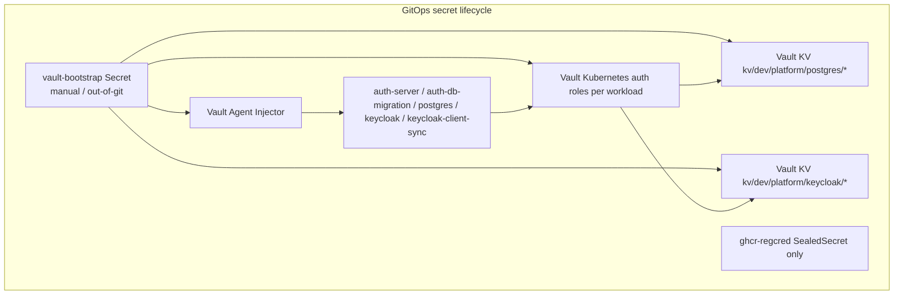

### 4. 이전 구조 대비 변경점
- `auth-server-secret.sealedsecret.yaml`과 `platform-secret.sealedsecret.yaml`을 제거하고, runtime secret source를 Vault KV로 전환했습니다.
- HashiCorp 공식 Helm chart를 사용하는 `vault-agent-injector` Argo CD Application을 추가했습니다.
- `auth-server`, `auth-db-migration`, `postgres`, `keycloak`, `keycloak-client-sync`에 Vault Agent Injector annotation을 적용하고 Kubernetes auth role 기반으로 secret을 주입받도록 변경했습니다.
- runtime KV path를 `platform/postgres/superuser`, `platform/postgres/auth-server`, `platform/postgres/keycloak`, `platform/keycloak/bootstrap-admin`, `platform/keycloak/client-auth-server`처럼 목적/소유권 기준으로 세분화했습니다.
- `auth-db-migration`과 `keycloak-client-sync`를 전용 ServiceAccount와 Vault role로 분리해 app/runtime 권한을 job과 분리했습니다.
- base/prod 매니페스트의 Kubernetes Secret 계약도 `postgres-superuser-credentials`, `postgres-auth-server-credentials`, `postgres-keycloak-credentials`, `keycloak-bootstrap-admin`, `keycloak-client-auth-server`처럼 목적별 이름으로 분해했습니다.
- `vault-bootstrap`은 Git에 넣지 않는 수동 bootstrap secret으로 분리하고, Vault server는 부팅 시 Kubernetes auth/policy/role을 자동 구성하도록 바꿨습니다.
- 현재 범위는 dev 운영 환경이므로 Vault role/policy 이름도 `*-dev` 기준으로만 구성했습니다.
- `ghcr-regcred`는 image pull secret 특성상 Injector로 대체할 수 없어서 SealedSecret으로 유지했습니다.

### 5. 해결된 내용
- 이제 앱/플랫폼 runtime secret의 기준점이 Git의 암호화 파일이 아니라 Vault가 되어, secret lifecycle이 Git commit 중심 구조에서 벗어났습니다.
- Vault Kubernetes auth와 role 분리를 통해 `auth-server`, `auth-db-migration`, `postgres`, `keycloak`, `keycloak-client-sync`가 각자 필요한 범위만 읽도록 최소 권한 구조를 만들었습니다.
- 정적 Kubernetes Secret 계약도 blob 두세 개 대신 목적별 credential 단위로 나뉘어, rotation과 접근 제어 범위를 더 좁힐 수 있게 됐습니다.
- `auth-server`는 Injector가 제공한 Vault token file을 통해 Vault Transit을 계속 사용할 수 있게 되어, 정적 Vault token SealedSecret 없이도 동작할 기반이 생겼습니다.
- 현재 구조에서 Git에 남는 비밀 항목은 bootstrap과 image pull 같은 예외 케이스로 좁혀졌고, 운영 secret 흐름과 예외 secret 흐름을 구분할 수 있게 됐습니다.

## Cycle 7

### 1. 초기 구조
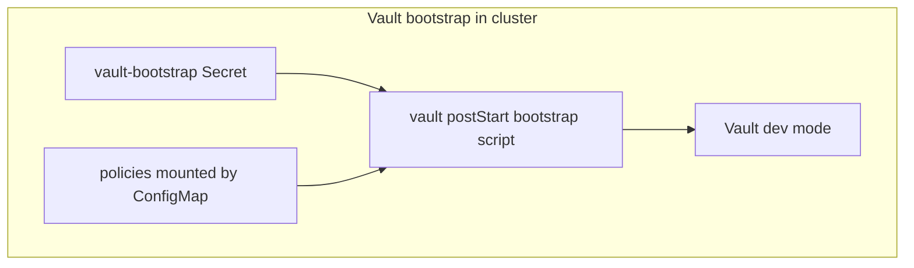

### 2. 문제점
- root token이 Kubernetes Secret 형태로 클러스터 안에 남아 있어, 운영자가 원한 `root token out of cluster` 조건을 만족하지 못했습니다.
- Vault policy/role bootstrap이 pod lifecycle에 묶여 있어, 초기화 작업이 GitOps 런타임과 섞여 있었습니다.
- Vault server가 `-dev` 모드로 실행되고 있어, 수동 init/unseal과 root token revoke 기반 운영 절차를 적용할 수 없었습니다.
- bootstrap 절차와 KV 입력 절차가 overlay 파일 안에 섞여 있어, 실제 운영 runbook과 배포 manifest의 경계가 불분명했습니다.

### 3. 변경 후 구조
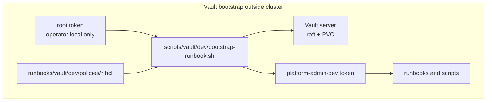

### 4. 이전 구조 대비 변경점
- Vault bootstrap용 `vault-bootstrap` Kubernetes Secret과 in-cluster `postStart` bootstrap 흐름을 제거했습니다.
- Vault server는 `-dev` 모드 대신 config file 기반 단일-node raft 저장소와 PVC를 사용하도록 변경했습니다.
- Vault policy와 bootstrap 로직을 GitOps overlay 밖의 `runbooks/vault/dev/`로 이동해, 운영자가 클러스터 밖에서 직접 실행하는 구조로 바꿨습니다.
- `bootstrap-runbook.sh`는 root token으로 1회 bootstrap을 수행한 뒤 `platform-admin-dev` orphan token을 만들고 root token revoke까지 처리하도록 바꿨습니다.
- KV 값 입력 예시도 overlay에서 제거하고 runbook 디렉터리로 이동시켜, manifest와 운영 절차를 분리했습니다.

### 5. 해결된 내용
- 이제 root token이 Kubernetes 안에 저장되지 않고, 초기 bootstrap에만 클러스터 밖에서 사용되도록 구조가 정리되었습니다.
- Vault bootstrap이 pod 기동 과정과 분리되어, GitOps manifest는 런타임 배포에만 집중하고 초기 운영 절차는 runbook으로 분리되었습니다.
- Vault 운영 흐름이 `init/unseal -> bootstrap -> admin token 발급 -> root revoke` 순서로 명확해져 dev 운영 환경 기준에 더 가까워졌습니다.
- 이후에는 `platform-admin-dev` 같은 제한된 운영 토큰으로 KV 갱신과 정책 보조 작업을 할 수 있어, root token을 상시 들고 있을 필요가 없어졌습니다.

## Cycle 8

### 1. 초기 구조
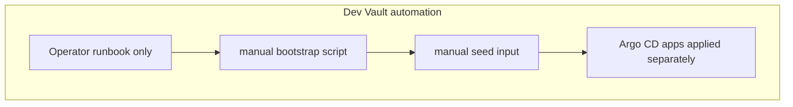

### 2. 문제점
- runbook만으로는 dev Vault KV 입력과 auth/policy/role reconcile이 계속 운영자 수동 절차에 묶여 있었습니다.
- GitOps repo 안에 자동 파이프라인이 없어, KV 준비와 Argo CD dev Application 적용 순서를 일관되게 맞추기 어려웠습니다.
- 현재 단일 Vault 구조에서는 진짜 Transit auto-unseal을 바로 적용할 수 없는데, 문서상으로는 그 경계가 충분히 드러나지 않았습니다.

### 3. 변경 후 구조
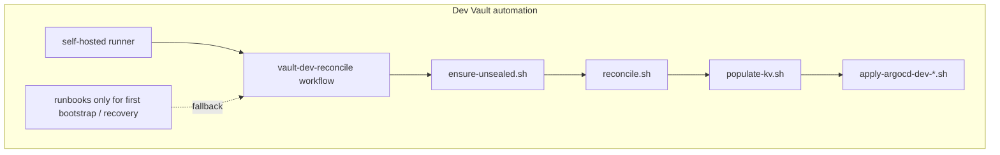

### 4. 이전 구조 대비 변경점
- self-hosted runner 전용 workflow `.github/workflows/vault-dev-reconcile.yaml` 을 추가했습니다.
- workflow는 당시 CI secret store에 저장된 비밀값을 사용해 unseal/reconcile/populate/apply를 자동 수행했습니다.
- 기존 runbook의 정책과 절차를 재사용할 수 있도록 `scripts/vault/dev/` 아래에 automation용 스크립트를 분리했습니다.
- README와 runbook에 자동화에 필요한 CI secret 목록과 현재 자동화 범위를 명시했습니다.
- Transit auto-unseal은 적용했다고 표기하지 않고, 별도 unseal provider Vault/HSM/KMS가 필요한 후속 아키텍처 작업임을 분명히 남겼습니다.

### 5. 해결된 내용
- 이제 dev 환경에서는 Vault KV 준비와 Argo CD dev 정의 적용이 self-hosted runner workflow로 자동 수행될 수 있게 되었습니다.
- 운영자는 최초 bootstrap 또는 복구 시에만 runbook을 보고 개입하면 되고, 평소 dev reconcile은 CI secret store 기반 자동화로 넘길 수 있습니다.
- 현재 구조에서 자동화된 부분과 아직 별도 아키텍처가 필요한 부분(Transit auto-unseal)이 명확히 분리되어, 다음 변경 방향을 혼동하지 않게 됐습니다.

## Cycle 9

### 1. 초기 구조
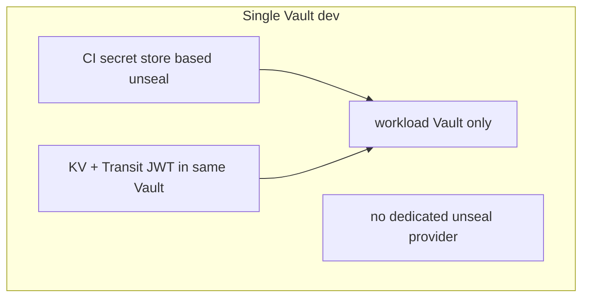

### 2. 문제점
- 단일 Vault 구조에서는 runtime secret은 Vault로 옮길 수 있어도, Vault 서버 자체의 unseal trust boundary는 여전히 CI secret store에 크게 의존했습니다.
- `root token 직접 사용 금지`, `bootstrap 최소화`, `trust boundary를 Vault 쪽으로 이동` 같은 현업형 dev 운영 방향을 만족시키려면 별도 unseal provider가 필요했습니다.
- README와 자동화 흐름도 아직 단일 Vault 기준 설명이 남아 있어, 실제 운영 구조와 설명이 어긋날 위험이 있었습니다.

### 3. 변경 후 구조
```mermaid
flowchart TD
  subgraph AFTER[Two Vault dev]
    B1[vault-transit provider]
    B2[workload Vault]
    B3[Vault Agent Injector]
    B4[CI runner automation]
    B5[runbooks for first bootstrap]
  end

  B1 -->|transit auto-unseal| B2
  B2 -->|KV + Kubernetes auth + Transit JWT| B3
  B4 --> B1
  B4 --> B2
  B5 --> B1
  B5 --> B2
```

### 4. 이전 구조 대비 변경점
- `infra/vault-transit/overlays/dev` 와 `argocd/applications/dev/infra/vault-transit.yaml` 을 추가해 unseal provider Vault를 별도 infra로 분리했습니다.
- workload Vault config에 transit seal stanza를 추가하고, `vault-transit-seal` 최소 권한 token으로 auto-unseal 하도록 변경했습니다.
- self-hosted runner workflow는 provider bootstrap -> workload reconcile -> KV populate -> app apply 순서로 재구성했습니다.
- `scripts/vault-transit/dev/` 와 `runbooks/vault-transit/dev/` 를 추가해 provider Vault 전용 bootstrap/policy 경로를 분리했습니다.
- README 최상단 최신 아키텍처, secret lifecycle, auto-unseal 설명을 2-Vault 구조 기준으로 갱신했습니다.

### 5. 해결된 내용
- 이제 workload Vault의 unseal trust boundary가 단순 CI secret store 의존에서 `vault-transit` provider Vault 기반 구조로 한 단계 올라갔습니다.
- runtime secret, JWT transit signing, workload Vault 운영, unseal provider 역할이 분리되어 현업형 dev 운영 방향에 더 가까워졌습니다.
- 단일 Vault보다 운영 난이도는 높아졌지만, root token 직접 사용 최소화와 운영 신뢰 경계 분리 측면에서는 더 나은 dev 구조를 갖추게 됐습니다.

## Cycle 10

### 1. 초기 구조
```mermaid
flowchart TD
  subgraph BEFORE[2-Vault but workflow secrets remain]
    A1[CI secret store]
    A2[provider Vault]
    A3[workload Vault]
  end

  A1 -->|app secret values + bootstrap tokens| A3
  A1 -->|provider token| A2
```

### 2. 문제점
- Vault를 2개로 나눴어도, workflow에 앱 비밀값과 workload Vault bootstrap token이 남아 있으면 여전히 GitOps CI가 secret source처럼 보일 수 있었습니다.
- 다른 앱 repo workflow에는 없는 민감값이 이 repo workflow에만 남아 있어, 운영 구조 일관성이 떨어졌습니다.
- 목표였던 `비밀 배포의 신뢰 경계가 SealedSecret/CI가 아니라 Vault에 있어야 한다`는 방향이 완전히 충족되지 않았습니다.

### 3. 변경 후 구조
```mermaid
flowchart TD
  subgraph AFTER[Provider Vault as source of truth]
    B1[CI secret store]
    B2[vault-transit provider Vault]
    B3[workload Vault]
  end

  B1 -->|provider unseal/bootstrap only| B2
  B2 -->|seed values + workload bootstrap token| B3
```

### 4. 이전 구조 대비 변경점
- `vault-dev-reconcile` workflow에서 앱 비밀값과 workload Vault bootstrap token을 제거했습니다.
- `scripts/vault/dev/populate-kv.sh` 와 `scripts/vault/dev/reconcile.sh` 는 provider Vault KV에서 값을 읽어 workload Vault에 반영하도록 변경했습니다.
- provider Vault에 workload seed 값을 넣는 실행 스크립트 `scripts/vault-transit/dev/populate-workload-seeds.sh` 와 참고용 `runbooks/vault-transit/dev/populate-workload-seeds.example.sh` 를 분리했습니다.
- README와 runbook에서 CI secret store에는 provider Vault 접근용 최소값만 남고, 실제 workload secret source는 provider Vault라는 점을 명시했습니다.

### 5. 해결된 내용
- 이제 workflow는 orchestration만 담당하고, 실제 앱/플랫폼 secret 값은 provider Vault에서 workload Vault로 흘러가는 구조가 되었습니다.
- CI secret store에 남는 민감값 범위가 줄어들어, `Vault 안에 secret source of truth를 두자`는 목표에 더 가까워졌습니다.
- 다른 앱 repo 기준으로 봐도 이 저장소만 workflow에 앱 비밀값을 직접 쥐고 있던 불균형이 해소되었습니다.

## Cycle 11

### 1. 초기 구조
```mermaid
flowchart TD
  subgraph BEFORE[Infra layout]
    A1[infra/platform = postgres + keycloak + workload vault]
    A2[infra/vault-transit = transit provider]
  end
```

### 2. 문제점
- `vault-transit` 만 따로 빠져 있고 workload Vault는 `platform` 안에 남아 있어, infra 경계가 namespace/역할 기준으로 일관되지 않았습니다.
- `platform` 이라는 이름만 보면 postgres/keycloak 묶음으로 이해되는데, 여기에 workload Vault까지 들어 있어 해석이 애매했습니다.
- 구조가 애매하면 문서와 운영 흐름을 볼 때도 `platform` 과 `vault` 의 책임이 섞여 보이기 쉬웠습니다.

### 3. 변경 후 구조
```mermaid
flowchart TD
  subgraph AFTER[Infra layout]
    A1[infra/platform = postgres + keycloak]
    A2[infra/vault = workload vault]
    A3[infra/vault-transit = transit provider]
  end
```

### 4. 이전 구조 대비 변경점
- workload Vault 리소스를 `infra/platform` 에서 분리해 `infra/vault/base|overlays` 로 이동했습니다.
- Argo CD infra app도 `vault-transit`, `vault`, `platform` 3개로 역할이 드러나도록 나눴습니다.
- workload Vault service 주소를 `vault.vault.svc.cluster.local` 기준으로 정리하고, 관련 config/script/document를 모두 새 namespace 기준으로 갱신했습니다.
- `platform` 은 이제 postgres/keycloak 영역만 담당하고, `vault` 는 workload secret/runtime auth/transit JWT를 담당하도록 구조를 고정했습니다.

### 5. 해결된 내용
- 이제 infra 디렉터리와 namespace가 역할 기준으로 일치해, 구조 해석과 운영 설명이 훨씬 자연스러워졌습니다.
- `platform`, `vault`, `vault-transit` 이 각각 무엇을 위한 스택인지 경로만 봐도 바로 드러납니다.
- 이후 더 깊게 파고들 때도 어떤 변경이 어느 스택의 책임인지 구분하기 쉬워졌습니다.

## Cycle 12

### 1. 초기 구조
```mermaid
flowchart TD
  subgraph BEFORE[Internal-only dev app network]
    A1[auth-server ClusterIP]
    A2[api-server ClusterIP]
    A3[keycloak ClusterIP]
    A4[cluster-local URLs only]
  end

  A4 --> A1
  A4 --> A2
  A4 --> A3
```

### 2. 문제점
- 앱 접근 경로가 사실상 cluster 내부 DNS에만 묶여 있어, 브라우저 callback/redirect 를 거는 dev 플로우를 노트북 관점에서 설명하기 어려웠습니다.
- `auth-server`, `api-server`, `keycloak` 이 모두 포트가 드러난 내부 URL에 결합돼 있어, north-south 진입점을 붙이기 전제도 약했습니다.
- 리뷰에서 지적한 `연결만 되면 되는 구조` 에서 최소한의 ingress 경계와 외부 접근 경로가 부족했습니다.

### 3. 변경 후 구조
```mermaid
flowchart TD
  subgraph AFTER[Ingress-backed dev app network]
    B1[traefik ingress]
    B2[auth-server ClusterIP:80]
    B3[api-server ClusterIP:80]
    B4[keycloak ClusterIP:80]
    B5[local hosts mapping on operator laptop]
  end

  B5 --> B1
  B1 --> B2
  B1 --> B3
  B1 --> B4
```

### 4. 이전 구조 대비 변경점
- `apps/auth-server/overlays/dev`, `apps/api-server/overlays/dev`, `infra/platform/overlays/dev` 에 `Ingress` 를 추가해 north-south 진입점을 만들었습니다.
- `auth-server`, `api-server`, `keycloak` 서비스 포트를 각각 `80 -> targetPort` 형태로 정리해 내부/외부에서 같은 호스트 표기를 쓰기 쉽게 맞췄습니다.
- dev 설정의 issuer/base URL 에서 `:8080/:8081/:8082` 포트 결합을 제거하고, ingress 가능한 host 기준으로 정리했습니다.
- 노트북 dev 한계를 감안해 별도 split-horizon DNS 대신 현재 서비스 FQDN 을 ingress host로 재사용하고, 운영자 로컬 `hosts` 매핑으로 외부 접근을 여는 절충안을 택했습니다.

### 5. 해결된 내용
- 이제 dev도 최소한 `ClusterIP 뒤 Ingress` 구조가 되어, callback/redirect 가 필요한 앱 접근 경로를 north-south 관점에서 설명할 수 있게 됐습니다.
- 앱 설정이 내부 포트에 덜 결합돼, 이후 별도 dev 사설 도메인을 붙일 때도 변경 폭이 줄어듭니다.
- namespace 간 통신 제한은 이후 사이클에서 더 세분화할 수 있도록 기반만 먼저 깔았습니다.

## Cycle 13

### 1. 초기 구조
```mermaid
flowchart TD
  subgraph BEFORE[HTTP ingress only]
    A1[auth/api/keycloak ingress]
    A2[internal service DNS]
    A3[no namespace traffic policy]
  end

  A1 --> A2
  A3 --> A2
```

### 2. 문제점
- public host와 internal host가 완전히 분리되지 않아, dev 기준 public 경로를 일관되게 설명하기 어려웠습니다.
- east-west 제한이 전혀 없으면, namespace를 나눠도 실제 통신 경계가 거의 없는 상태와 다르지 않았습니다.

### 3. 변경 후 구조
```mermaid
flowchart TD
  subgraph AFTER[HTTP + east-west guardrail]
    B1[public ExternalName host]
    B2[traefik web ingress]
    B3[namespace NetworkPolicy allowlist]
  end

  B1 --> B2
  B3 --> B2
```

### 4. 이전 구조 대비 변경점
- `auth-public`, `api-public`, `keycloak-public` `ExternalName` 서비스를 추가해 cluster 내부에서도 public host를 `traefik` 경유로 해석할 수 있게 했습니다.
- `Ingress` 는 `web` entrypoint 기반의 HTTP 경로로 단순화했습니다.
- `keycloak` 은 public hostname과 proxy header를 인지하도록 패치했습니다.
- `auth-dev`, `api-dev`, `platform` 에는 `default deny + allowlist` `NetworkPolicy` 를 추가해 ingress, DNS, Vault, Postgres, Traefik 경로만 열어두었습니다.

### 5. 해결된 내용
- 이제 dev도 north-south 경로를 public host 하나로 일관되게 쓸 수 있습니다.
- namespace 분리가 단순 디렉터리/리소스 분리만이 아니라 실제 통신 허용 범위로도 반영되기 시작했습니다.

## Cycle 14

### 1. 초기 구조
```mermaid
flowchart TD
  subgraph BEFORE[Ingress bootstrap leftovers]
    A1[plain Secret in Git]
    A2[vault namespace out of policy scope]
    A3[local access steps undocumented]
  end
```

### 2. 문제점
- ingress 관련 secret이 일반 Secret 평문으로 repo에 남아 있으면 Git에 올릴 수 있는 상태라고 보기 어려웠습니다.
- `vault` namespace는 가장 민감한 통신 경계 중 하나인데, 정책 범위에서 빠져 있으면 east-west 제한이 덜 완성된 상태였습니다.
- 운영자 로컬 접근 절차가 문서화되지 않으면 브라우저/CLI 검증이 사람마다 달라질 수 있었습니다.

### 3. 변경 후 구조
```mermaid
flowchart TD
  subgraph AFTER[Git-safe ingress config]
    B1[Git-safe ingress secret handling]
    B2[vault server allowlist policy]
  end

  B1 --> B2
```

### 4. 이전 구조 대비 변경점
- `vault` overlay에 workload Vault ingress/egress 정책과 injector webhook ingress 정책을 추가했습니다.

### 5. 해결된 내용
- `vault` 도 최소한 서버 트래픽과 webhook ingress 경계가 정책에 반영돼, east-west 제한 범위가 더 자연스러워졌습니다.

## Cycle 15

### 1. 초기 구조
```mermaid
flowchart TD
  subgraph BEFORE[Dev bootstrap blockers]
    A1[Argo CD repo auth missing]
    A2[self-hosted runner tool mismatch]
    A3[vault-transit raft config incomplete]
  end

  A1 --> A3
  A2 --> A3
```

### 2. 문제점
- Argo CD가 `Project-Auth-GitOps` private repo를 읽지 못해 `vault-transit-dev`, `platform-dev`, `auth-server-dev`, `api-server-dev` 가 모두 `ComparisonError` 상태에 머물렀습니다.
- self-hosted runner는 등록됐지만 `vault`, `terraform` 같은 필수 CLI가 없어 workflow가 `Validate required tools` 단계에서 바로 실패했습니다.
- `vault-transit` deployment가 생성된 뒤에도 Vault가 `Cluster address must be set when using raft storage` 에러로 죽어 bootstrap을 진행할 수 없었습니다.

### 3. 변경 후 구조
```mermaid
flowchart TD
  subgraph AFTER[Diagnosable bootstrap flow]
    B1[argocd repo-creds secret]
    B2[self-hosted runner with required CLIs]
    B3[vault-transit raft api/cluster addr]
    B4[repeatable troubleshooting notes]
  end

  B1 --> B3
  B2 --> B3
  B3 --> B4
```

### 4. 이전 구조 대비 변경점
- Argo CD GitHub 인증은 UI 대신 `repo-creds` secret으로 선언형 등록하는 절차를 사용했습니다.
- runner 이슈는 GitHub Actions 로그만 보지 않고, runner 호스트에서 `command -v ...` 로 실제 설치 여부를 확인하는 방식으로 정리했습니다.
- `infra/vault-transit/base/files/vault/vault.hcl` 과 `infra/vault/base/files/vault/vault.hcl` 에 `api_addr`, `cluster_addr`, `cluster_address` 를 추가하고, 두 service/deployment에 `8201` cluster 포트를 열었습니다.
- README에 트러블슈팅 메모 규칙을 추가해, 이후에도 명령과 판단 근거를 함께 누적 기록할 수 있게 했습니다.

### 5. 해결된 내용
- Argo CD repo 인증 문제는 선언형 secret 적용 후 `vault-transit-dev` 가 `Synced` 로 전환되는 것으로 원인을 분리할 수 있게 됐습니다.
- self-hosted runner 이슈는 "workflow 코드 문제"와 "runner 환경 문제"를 구분해서 진단하는 기준이 생겼습니다.
- `vault-transit` CrashLoopBackOff 는 raft 설정 누락이 원인임을 로그로 확인했고, 동일 패턴이 `vault` 에 재발하지 않도록 base config까지 함께 보완했습니다.

### 6. 트러블슈팅 메모
- 재현/확인 명령: `kubectl -n argocd describe application vault-transit-dev`
  핵심 관찰값: `Failed to load target state`, `authentication required: Repository not found`
- 판단 근거: app/project 객체는 존재하지만 repo-server가 GitHub repo를 읽지 못해 sync 이전 단계에서 실패한다고 판단했습니다.
- 수정 또는 조치: `/tmp/argocd-github-repo-creds.yaml` 로 `argocd.argoproj.io/secret-type=repo-creds` secret을 적용하고 `argocd.argoproj.io/refresh=hard` 로 강제 refresh 했습니다.
- 검증 명령: `kubectl -n argocd describe application vault-transit-dev`
  검증 결과: `OperationCompleted`, `Sync Status: Synced`, `namespace/vault-transit created`
- 재현/확인 명령: runner 호스트에서 `command -v kubectl vault jq base64 curl terraform`
  핵심 관찰값: `vault`, `terraform` 이 비어 있었고 workflow 로그도 `vault is required on the self-hosted runner` 에서 종료됐습니다.
- 판단 근거: job이 GitHub-hosted가 아니라 runner 로컬 셸에서 실행되므로, 해당 머신에 CLI가 실제 설치돼 있어야 한다고 판단했습니다.
- 수정 또는 조치: runner 호스트에 HashiCorp apt repo를 추가하고 `vault`, `terraform` 을 설치했습니다.
- 검증 명령: `vault version`, `terraform version`
- 재현/확인 명령: `kubectl -n vault-transit rollout status deploy/vault-transit --timeout=180s`, `kubectl -n vault-transit logs deploy/vault-transit --tail=200`
  핵심 관찰값: `CrashLoopBackOff`, `Cluster address must be set when using raft storage`
- 판단 근거: 이미지 pull/PVC 문제는 아니고 Vault 프로세스가 raft listener 설정 부족 때문에 바로 종료된다고 판단했습니다.
- 수정 또는 조치: `vault-transit` 와 `vault` base `vault.hcl`, deployment, service에 raft cluster 주소와 `8201` 포트를 추가했습니다.
- 검증 명령: `kubectl kustomize infra/vault-transit/overlays/dev`, `kubectl kustomize infra/vault/overlays/dev`

## Cycle 16

### 1. 초기 구조
```mermaid
flowchart TD
  subgraph BEFORE[Vault transit unstable startup]
    A1[raft address incomplete]
    A2[image entrypoint touching read-only config]
    A3[RollingUpdate on single PVC]
  end

  A1 --> A2
  A2 --> A3
```

### 2. 문제점
- `vault-transit` application이 sync된 뒤에도 pod가 `CrashLoopBackOff` 에 빠져 bootstrap을 시작할 수 없었습니다.
- 로그에는 `Cluster address must be set when using raft storage` 와 `Could not chown /vault/config` 가 함께 보여, 설정 누락과 기동 방식 문제가 섞여 있었습니다.
- 단일 replica와 단일 PVC를 쓰는 `vault`/`vault-transit` 을 `RollingUpdate` 로 굴리면 old/new pod가 겹치면서 rollout 안정성이 떨어졌습니다.

### 3. 변경 후 구조
```mermaid
flowchart TD
  subgraph AFTER[Stable single-node Vault startup]
    B1[raft api_addr + cluster_addr]
    B2[listener cluster_address + 8201 port]
    B3[copy config to /tmp before start]
    B4[Recreate deployment strategy]
  end

  B1 --> B2
  B2 --> B3
  B3 --> B4
```

### 4. 이전 구조 대비 변경점
- `infra/vault-transit/base/files/vault/vault.hcl` 과 `infra/vault/base/files/vault/vault.hcl` 에 `api_addr`, `cluster_addr`, listener `cluster_address` 를 추가했습니다.
- 두 service/deployment에 `8201` cluster 포트를 추가했습니다.
- `vault` 와 `vault-transit` deployment를 `strategy: Recreate` 로 바꿨습니다.
- 두 deployment 모두 ConfigMap의 `vault.hcl` 을 `/tmp/vault.hcl` 로 복사한 뒤 `vault server -config=/tmp/vault.hcl` 로 실행하도록 바꿨습니다.

### 5. 해결된 내용
- raft storage 필수 설정 누락으로 인한 즉시 종료 원인을 코드에서 제거했습니다.
- read-only ConfigMap mount와 이미지 entrypoint 충돌 가능성을 줄여, 기동 경로가 더 단순해졌습니다.
- 단일 PVC 기반 Vault rollout에서 old/new pod 겹침을 최소화하는 방향으로 배포 전략을 정리했습니다.

### 6. 트러블슈팅 메모
- 재현/확인 명령: `kubectl -n vault-transit rollout status deploy/vault-transit --timeout=180s`
  핵심 관찰값: `deployment "vault-transit" exceeded its progress deadline`
- 재현/확인 명령: `kubectl -n vault-transit get deploy,pods -o wide`
  핵심 관찰값: pod가 `CrashLoopBackOff`
- 재현/확인 명령: `kubectl -n vault-transit logs deploy/vault-transit --tail=200`
  핵심 관찰값: `Cluster address must be set when using raft storage`, `Could not chown /vault/config`
- 판단 근거: config 값 부족만이 아니라, Vault 이미지 기본 entrypoint와 read-only ConfigMap mount 조합도 불안정 요인이라고 판단했습니다.
- 수정 또는 조치: raft 주소/포트 보강, `Recreate` 전략 적용, `/tmp` 복사 후 실행 방식으로 deployment를 단순화했습니다.
- 검증 명령: `kubectl kustomize infra/vault-transit/overlays/dev`, `kubectl kustomize infra/vault/overlays/dev`

## Cycle 17

### 1. 초기 구조
```mermaid
flowchart TD
  subgraph BEFORE[Workload Vault auth and secret convergence]
    A1[vault healthy but auth login 403]
    A2[vault egress missing]
    A3[legacy DB state vs new Vault values]
    A4[Vault Agent template newline breakage]
  end

  A1 --> A2
  A2 --> A3
  A3 --> A4
```

### 2. 문제점
- `postgres`, `auth-db-migration`, `keycloak` pod의 Vault Agent가 `auth/kubernetes/login` 에서 `403 permission denied` 를 내며 secret을 못 받았습니다.
- `vault` namespace default-deny egress 때문에 workload Vault가 Kubernetes API와 PostgreSQL에 나가지 못했습니다.
- Vault KV 값은 최신으로 바뀌었지만 PostgreSQL PVC는 기존 사용자 비밀번호를 유지하고 있어, 앱이 주입받은 값과 DB 내부 상태가 어긋났습니다.
- Vault Agent template의 whitespace trim 때문에 `export` 문이 줄바꿈 없이 붙어서 잘못된 env 파일이 렌더링됐습니다.

### 3. 변경 후 구조
```mermaid
flowchart TD
  subgraph AFTER[Restored workload secret path]
    B1[workload vault kubernetes auth restored]
    B2[vault -> kubernetes api egress]
    B3[vault -> postgres egress]
    B4[KV values aligned with runtime state]
    B5[template newlines preserved]
  end

  B1 --> B2
  B1 --> B3
  B2 --> B4
  B3 --> B4
  B4 --> B5
```

### 4. 이전 구조 대비 변경점
- `terraform/vault/dev` 로 workload Vault의 `auth/kubernetes`, role, database, transit 구성을 다시 reconcile 했습니다.
- `infra/vault/overlays/dev/networkpolicy.yaml` 에 Kubernetes API egress와 PostgreSQL egress를 추가했습니다.
- provider/workload Vault KV와 실제 PostgreSQL 사용자 상태를 다시 맞추는 절차를 수행했습니다.
- `apps/auth-server/overlays/dev/deployment.vault-patch.yaml`, `infra/platform/overlays/dev/keycloak.vault-patch.yaml`, `infra/platform/overlays/dev/keycloak-client-sync.vault-patch.yaml`, `infra/platform/overlays/dev/postgres.vault-patch.yaml` 에서 Vault template 줄바꿈이 유지되도록 수정했습니다.

### 5. 해결된 내용
- Workload Vault가 앱 service account JWT를 받아들여 Vault Agent 인증이 진행되기 시작했습니다.
- `postgres` init container는 Vault Agent 인증을 통과했고, DB credential 발급 단계로 넘어갈 수 있게 됐습니다.
- Keycloak/Auth가 읽는 injected env 파일이 shell 문법상 유효한 형태로 렌더링되기 시작했습니다.
- 남은 앱 health 문제를 “Vault auth 실패”가 아니라 “DB credential mismatch / runtime convergence” 단계로 좁힐 수 있게 됐습니다.

### 6. 트러블슈팅 메모
- 재현/확인 명령: `kubectl -n platform logs postgres-0 -c vault-agent-init --tail=80`, `kubectl -n auth-dev logs <migration-pod> -c vault-agent-init --tail=80`
  핵심 관찰값: `auth/kubernetes/login` 에서 `403 permission denied`
- 재현/확인 명령: `vault auth list`, `vault read auth/kubernetes/config`, `vault read auth/kubernetes/role/<role>`
  핵심 관찰값: `kubernetes` auth mount가 한때 사라졌고, backend/role을 다시 복구해야 했음
- 재현/확인 명령: `curl .../tokenreviews` with reviewer token
  핵심 관찰값: Kubernetes `TokenReview` 자체는 성공했고, 문제를 Vault backend / network 쪽으로 좁힐 수 있었음
- 재현/확인 명령: `kubectl -n vault exec deploy/vault -- nslookup postgres.platform.svc.cluster.local`
  핵심 관찰값: workload Vault pod에서는 headless service 대표 이름이 `NXDOMAIN` 이었고, `postgres-0.postgres.platform.svc.cluster.local` 은 해석됨
- 판단 근거: `vault` 가 TokenReview와 DB dynamic credential 발급을 하려면 Kubernetes API / PostgreSQL egress가 모두 필요했고, 둘 중 하나라도 막히면 downstream pod가 전부 `Init` 단계에 머문다고 판단했습니다.
- 수정 또는 조치:
  - `infra/vault/overlays/dev/networkpolicy.yaml` 에 Kubernetes API / PostgreSQL egress 추가
  - workload Vault auth backend 재생성 및 role 재적용
  - provider/workload Vault KV와 PostgreSQL 실제 사용자 비밀번호 재정렬
  - Vault template 줄바꿈 수정
- 검증 명령:
  - `vault read database/creds/auth-db-migration-dev`
  - `kubectl -n platform exec postgres-0 -c postgres -- psql ...`
  - `kubectl -n platform exec <keycloak-pod> -c vault-agent -- cat /vault/secrets/keycloak-env`
  - `kubectl -n argocd get applications platform-dev auth-server-dev api-server-dev -o wide`

## Cycle 18

### 1. 초기 구조
```mermaid
flowchart TD
  subgraph BEFORE[CI local state drift]
    A1[terraform local backend]
    A2[runner cannot see existing state]
    A3[workflow AppRole lacks bootstrap privileges]
  end

  A1 --> A2
  A2 --> A3
```

### 2. 문제점
- CI의 `terraform/vault-transit/dev apply` 가 매번 `Plan: 11 to add` 로 시작하며 이미 존재하는 `kv/`, `transit/`, `approle` 을 다시 만들려 했습니다.
- `vault-transit` workflow AppRole 토큰은 기존 리소스 reconcile 용이지, 최초 bootstrap 수준의 `sys/auth/*` / `auth/token/create` 권한까지 갖지 않아 `403 permission denied` 가 났습니다.
- 원인은 runner가 `vault-transit-dev.tfstate` 를 못 보고 local backend state 없이 실행되고 있었기 때문이었습니다.

### 3. 변경 후 구조
```mermaid
flowchart TD
  subgraph AFTER[Fail-fast CI reconcile]
    B1[persistent terraform state path]
    B2[init -reconfigure with explicit backend path]
    B3[empty/missing state guard]
    B4[workflow token only reconciles existing resources]
  end

  B1 --> B2
  B2 --> B3
  B3 --> B4
```

### 4. 이전 구조 대비 변경점
- `.github/workflows/vault-dev-reconcile.yaml` 에 `TF_STATE_DIR` 을 추가해 runner workspace의 `.terraform-state` 를 명시적으로 사용하도록 바꿨습니다.
- `terraform init` 에 `-reconfigure -backend-config=path=...` 를 넣어 매 실행마다 state 경로를 명시적으로 고정했습니다.
- `vault-transit` state 파일이 없거나 비어 있으면 bootstrap처럼 create 시도하지 않고, 명확한 에러로 중단하도록 가드를 추가했습니다.

### 5. 해결된 내용
- CI가 state 없이 기존 리소스를 다시 만들려다가 실패하는 패턴을 조기에 차단할 수 있게 됐습니다.
- workflow AppRole 토큰이 “기존 리소스 reconcile” 용도라는 점을 workflow 자체에 반영해, bootstrap과 reconcile 경계를 분명히 했습니다.

### 6. 트러블슈팅 메모
- 재현/확인 명령: workflow 로그에서 `path is already in use at kv/`, `path is already in use at transit/`, `permission denied` 확인
- 재현/확인 명령: `terraform -chdir=terraform/vault-transit/dev state list`
  핵심 관찰값: 로컬에는 state가 있지만 CI 실행 컨텍스트에서는 state를 못 보는 패턴이었음
- 판단 근거: state가 없으니 Terraform이 기존 mount/auth backend를 신규 생성 대상으로 보고, workflow AppRole 토큰은 bootstrap 권한이 없어 403이 난다고 판단했습니다.
- 수정 또는 조치: workflow에서 state path를 고정하고, missing/empty state일 때 fail-fast 하도록 변경했습니다.
- 검증 명령: 다음 CI 실행에서 `Missing vault-transit Terraform state ...` 또는 정상 `state list` 통과 여부 확인

## Cycle 19

### 1. 초기 구조
```mermaid
flowchart TD
  subgraph BEFORE[Post-bootstrap runtime drift]
    A1[vault auth backend drift]
    A2[vault egress gaps]
    A3[persisted postgres state]
    A4[malformed injected env files]
    A5[CI local state missing]
  end

  A1 --> A2
  A2 --> A3
  A3 --> A4
  A5 --> A1
```

### 2. 문제점
- workload Vault는 살아 있었지만 `auth/kubernetes/login` 이 `403 permission denied` 를 내며 `postgres`, `auth-db-migration`, `keycloak` 의 Vault Agent init이 모두 막혔습니다.
- `vault` namespace egress가 Kubernetes API와 PostgreSQL까지 열려 있지 않아 TokenReview와 DB dynamic credential 발급이 실패했습니다.
- PostgreSQL PVC를 유지한 상태에서 Vault KV 값만 바꾸면 DB 내부 사용자 비밀번호와 새 주입값이 어긋나 Keycloak/Auth가 계속 로그인에 실패했습니다.
- Vault Agent template에서 aggressive trim을 써서 `export` 문이 붙어 렌더링되고, 실제 injected env 파일이 shell 문법상 깨졌습니다.
- CI는 local backend state를 못 본 채 기존 `vault-transit` 리소스를 다시 만들려 해서 `path is already in use` / `permission denied` 로 실패했습니다.

### 3. 변경 후 구조
```mermaid
flowchart TD
  subgraph AFTER[Recoverable runtime convergence]
    B1[workload vault auth recreated]
    B2[vault -> kubernetes api egress]
    B3[vault -> postgres egress]
    B4[provider/workload KV re-aligned]
    B5[postgres/keycloak runtime state re-aligned]
    B6[template newlines preserved]
    B7[CI imports or reuses local state]
  end

  B1 --> B2
  B1 --> B3
  B2 --> B4
  B3 --> B5
  B4 --> B5
  B5 --> B6
  B7 --> B1
```

### 4. 이전 구조 대비 변경점
- `terraform/vault/dev` 로 workload Vault의 `kubernetes` auth backend와 관련 role을 다시 복구했습니다.
- `infra/vault/overlays/dev/networkpolicy.yaml` 에 Kubernetes API egress, PostgreSQL egress를 추가했습니다.
- provider/workload Vault KV 값을 실제 persisted DB 상태와 비교해 다시 정렬하고, 필요 시 PostgreSQL 사용자 비밀번호도 직접 맞췄습니다.
- `apps/auth-server/overlays/dev/deployment.vault-patch.yaml`, `infra/platform/overlays/dev/keycloak.vault-patch.yaml`, `infra/platform/overlays/dev/keycloak-client-sync.vault-patch.yaml`, `infra/platform/overlays/dev/postgres.vault-patch.yaml` 의 Vault template 줄바꿈을 보존하도록 수정했습니다.
- `.github/workflows/vault-dev-reconcile.yaml` 에 local state 경로 고정, empty state guard, import 준비 경로를 추가해 CI가 bootstrap 리소스를 새로 만들려 하지 않도록 정리했습니다.

### 5. 해결된 내용
- `postgres` Vault Agent init은 최종적으로 인증 성공까지 확인됐고, `postgres-0` 는 `2/2 Running` 으로 회복됐습니다.
- `keycloak` 은 malformed env / DB auth 문제를 분리해서 볼 수 있게 됐고, bootstrap admin/DB credential 정합성까지 운영 관점에서 정리할 수 있게 됐습니다.
- `auth-server` 는 DB 연결 성공과 Spring Boot 초기화 단계까지 올라와, Vault transit/JWT 쪽 남은 런타임 오류만 분리해 볼 수 있게 됐습니다.
- CI는 최소한 state 부재를 모른 채 bootstrap을 다시 시도하는 패턴을 fail-fast 하도록 바뀌었습니다.

### 6. 트러블슈팅 메모
- 재현/확인 명령: `kubectl -n platform logs postgres-0 -c vault-agent-init --tail=80`, `kubectl -n auth-dev logs <pod> -c vault-agent-init --tail=80`
  핵심 관찰값: `auth/kubernetes/login` 에서 `403 permission denied`
- 재현/확인 명령: `vault auth list`, `vault read auth/kubernetes/config`, `vault read auth/kubernetes/role/<role>`
  핵심 관찰값: `kubernetes` auth mount가 한때 없어졌고, role/config를 다시 복구해야 했음
- 재현/확인 명령: `curl .../tokenreviews`
  핵심 관찰값: Kubernetes `TokenReview` 는 성공하므로 SA JWT 자체보다 Vault auth/backend/network 문제로 좁혀졌음
- 재현/확인 명령: `kubectl -n vault exec deploy/vault -- nslookup postgres.platform.svc.cluster.local`
  핵심 관찰값: 대표 headless service 이름은 `NXDOMAIN`, `postgres-0.postgres.platform.svc.cluster.local` 은 해석 가능
- 재현/확인 명령: `kubectl -n platform exec <keycloak-pod> -c vault-agent -- cat /vault/secrets/keycloak-env`
  핵심 관찰값: `export KC_DB_PASSWORD=...export KC_BOOTSTRAP_ADMIN_PASSWORD=...` 처럼 줄바꿈이 깨져 있었음
- 재현/확인 명령: `kubectl -n platform exec postgres-0 -c postgres -- psql ...`, `vault kv get ...`
  핵심 관찰값: PostgreSQL 내부 비밀번호와 Vault KV 주입값이 달라 PVC 기반 기존 상태와 새 입력값이 충돌하고 있었음
- 재현/확인 명령: CI 로그에서 `Plan: 11 to add`, `path is already in use`, `permission denied`
  핵심 관찰값: runner가 local backend state를 못 보고 기존 `vault-transit` 리소스를 신규 생성 대상으로 보고 있었음

## Cycle 20

### 1. 초기 구조
```mermaid
flowchart TD
  subgraph BEFORE[Partial state drift]
    A1[self-hosted runner workspace]
    A2[local backend state exists but is incomplete]
    A3[terraform sees some resources, misses others]
    A4[workflow token tries create on missing state entries]
  end

  A1 --> A2
  A2 --> A3
  A3 --> A4
```

### 2. 문제점
- CI는 더 이상 완전히 빈 state는 아니었지만, `vault-transit` state에 정책 일부만 남고 mount/auth/token 같은 핵심 리소스가 빠진 **partial state** 상태로 실행되고 있었습니다.
- 기존 workflow는 `state list` 가 완전히 비어 있을 때만 import 하도록 되어 있어, partial state일 때는 import 분기가 전혀 돌지 않았습니다.
- 그래서 Terraform은 빠진 리소스만 신규 생성 대상으로 보고 `kv/`, `transit/`, `approle/` 를 다시 만들려 했고, seal token 생성 단계에서는 `403 permission denied` 가 났습니다.
- 추가로 `vault_approle_auth_backend_role_secret_id` 는 Terraform provider가 import를 지원하지 않아, partial state 복구 시 이 리소스만은 다른 managed resource처럼 state로 되살릴 수 없었습니다.
- imported `vault_mount.kv` 는 live 상태에서 `type = "kv"` + `options.version = "2"` 로 읽히는데, 선언은 `type = "kv-v2"` 였기 때문에 partial state 복구 후에도 mount replacement가 다시 발생했습니다.
- imported `vault_token.seal` 은 기존 accessor revoke가 필요한데, workflow 정책에 `auth/token/revoke-accessor` 권한이 빠져 있었습니다.
- 같은 패턴은 이후 `terraform/vault/dev` 에도 다시 터질 수 있는 구조였습니다.

### 3. 변경 후 구조
```mermaid
flowchart TD
  subgraph AFTER[Per-resource state reconciliation]
    B1[terraform init with explicit backend path]
    B2[state show per managed resource]
    B3[missing resources imported individually]
    B4[apply runs only after state convergence]
  end

  B1 --> B2
  B2 --> B3
  B3 --> B4
```

### 4. 이전 구조 대비 변경점
- `.github/workflows/vault-dev-reconcile.yaml` 의 transit 단계 import 로직을 **empty-state 전용 가드**에서 **리소스 단위 ensure/import** 방식으로 변경했습니다.
- transit import 전에 live `vault-transit-automation-dev` policy를 현재 파일 내용으로 한 번 덮어쓰고, 새 토큰으로 다시 로그인하도록 바꿔 `auth/token/lookup-accessor` 같은 새 권한이 import 전에 즉시 반영되게 했습니다.
- import를 지원하지 않는 `vault_approle_auth_backend_role_secret_id.workflow` 는 ensure/import 대상에서 제외하고, state에 없으면 `apply` 때 새 secret ID를 발급하도록 정리했습니다.
- `terraform/vault-transit/dev/main.tf`, `terraform/vault/dev/main.tf` 의 KV mount 선언을 `type = "kv"` + `options = { version = "2" }` 로 바꾸고, mount에는 `prevent_destroy = true` 를 추가했습니다.
- `vault-transit` 에 대해 아래 리소스를 매 실행마다 `state show` 로 확인하고, 빠진 경우만 import 하도록 바꿨습니다.
  - `vault_mount.kv`, `vault_mount.transit`
  - `vault_auth_backend.approle`
  - `vault_policy.*`
  - `vault_approle_auth_backend_role.workflow`
  - `vault_approle_auth_backend_role_secret_id.workflow`
  - `vault_token.seal`
  - `vault_transit_secret_backend_key.workload_unseal`
  - `kubernetes_secret_v1.vault_transit_seal`
- 같은 방식으로 `terraform/vault/dev` 에도 workload Vault managed resource별 import 보강을 추가했습니다.
- `runbooks/vault-transit/dev/policies/vault-transit-automation-dev.hcl` 에 `auth/token/lookup-accessor`, `auth/token/revoke-accessor` 권한을 추가해 token import/replacement cleanup이 가능하도록 보강했습니다.

### 5. 해결된 내용
- self-hosted runner가 이전 실패 실행 때문에 **부분적으로만 남은 state** 를 가지고 있어도, 다음 실행에서 빠진 리소스를 개별 import 하며 수렴할 수 있게 됐습니다.
- CI가 “state가 조금이라도 있으니 안전하다”고 오판하고 bootstrap API를 다시 두드리는 경로를 막았습니다.
- transit 단계뿐 아니라 workload 단계도 같은 형태의 local backend drift에 대비할 수 있게 됐습니다.
- AppRole secret-id 리소스는 import 대신 재생성으로 수렴시키되, 기존 secret-id는 즉시 무효화되지 않으므로 현재 CI 로그인에 쓰는 값과 공존할 수 있게 했습니다.
- KV mount 선언과 live import 결과를 맞춰 mount replacement를 제거했고, mount에는 `prevent_destroy` 를 걸어 CI가 provider/workload KV를 다시 지우지 못하게 했습니다.
- seal token replacement가 필요한 경우에도 accessor revoke 권한이 있어 cleanup 단계까지 마칠 수 있게 했습니다.

### 6. 트러블슈팅 메모
- 재현/확인 명령: CI 로그에서 `Plan: 8 to add, 1 to change`, `path is already in use at kv/`, `path is already in use at approle/`, `permission denied`
  핵심 관찰값: 완전 빈 state라면 `Plan: 11 to add` 이어야 하는데, 일부 정책만 state에 남아 있어 **partial state** 였음
- 재현/확인 명령: `terraform -chdir=terraform/vault-transit/dev state list`
  핵심 관찰값: 로컬 정상 state에는 11개 managed resource가 모두 있었음
- 판단 근거: 기존 workflow는 `state list` 가 비었을 때만 import를 수행하므로, partial state에서는 import가 건너뛰어지고 빠진 리소스를 신규 생성 대상으로 보게 된다고 판단했습니다.
- 판단 근거: `vault_approle_auth_backend_role_secret_id` 는 provider가 import 미지원이므로, 그 항목까지 import 대상으로 유지하면 partial state 복구가 그 단계에서 항상 멈춘다고 판단했습니다.
- 판단 근거: `vault_mount.kv` plan에 `type "kv" -> "kv-v2"` replacement가 보인 것은 선언 방식 mismatch 때문이고, `vault_token.seal` 삭제 실패는 `auth/token/revoke-accessor` 권한 부재 때문이라고 판단했습니다.
- 수정 또는 조치:
  - workflow에 `ensure_transit_state_resource`, `ensure_workload_state_resource` 함수를 추가
  - 필요한 import ID를 accessor/path 기준으로 계산해 빠진 리소스만 import
  - transit import 전에 `vault policy write vault-transit-automation-dev ...` 후 재로그인
  - transit automation policy에 `auth/token/lookup-accessor`, `auth/token/revoke-accessor` 추가
  - import 미지원인 `vault_approle_auth_backend_role_secret_id` 는 ensure 대상에서 제외
  - transit/workload KV mount 선언을 `kv` + `options.version=2` 로 수정
  - transit/workload mount에 `prevent_destroy = true` 추가
- 검증 명령: 다음 CI 실행에서 `Importing missing vault-transit state for ...` / `Importing missing workload-vault state for ...` 로그가 먼저 나오고, 그 뒤 `terraform apply` 가 create 대신 reconcile로 수렴하는지 확인
